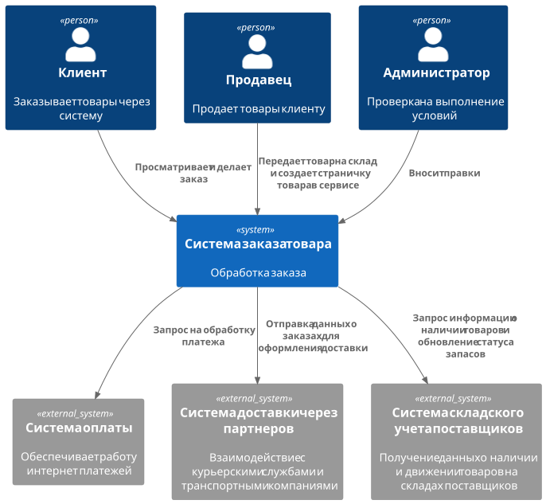
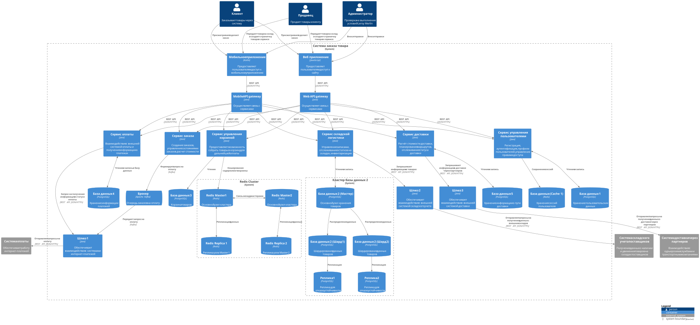

= Разделение монолита на микросервисы

== Предметная область

Вы работаете в крупной компании которая продает строительные материалы и товары для дома (как прототип можно рассматривать Леруа). Компании реализует товары как в своих оффлайн гипермаркетах так и через интернет магазин. У компании есть собственные склады, а также есть склады поставщиков. У компании есть свои своя служба доставки, а также доставка через партнеров. 

== Подход

Для перехода от монолита к микросервисной архитектуре я использовал подход DDD (Domain-Driven Design), который разбивает всю модель предметной области (домен) на поддомены. У каждого поддомена своя модель данных (Boundary context)

== Доменные области

Для того чтобы эффективно разбить систему на микросервисы, сначала выделим ключевые поддомены:

 1. **Cart subdomain**
Управляет процессом формирования корзины пользователем. Включает добавление, удаление и изменение количества товаров в корзине, применение скидок, расчет итоговой стоимости перед оформлением заказа.

 2. **Order subdomain**
Отвечает за все этапы обработки заказов, от создания заявки, подтверждения до оплаты.

 3. **Inventory Management subdomain**
Осуществляет контроль и управление запасами товаров на складах компании и у поставщиков. Включает поступление, хранение, списание и перемещение товаров между складами.

 4. **Delivery subdomain**
Управляет процессами логистики и доставки заказов. Включает выбор способов доставки, расчет сроков и стоимости, отслеживание статуса отправления, взаимодействие с партнерскими службами и внутренней логистикой компании.

 5. **User subdomain**
Отвечает за управление пользователями, включая регистрацию, аутентификацию, авторизацию, настройку профилей, управление ролями и доступами.

 6. **Payment subdomain**
Обеспечивает обработку платежей, интеграцию с банковскими системами и платежными шлюзами, управление возвратами, удержаниями и безопасностью транзакций

== Выделение микросервисов

На основе определенных поддоменов, выделяем микросервисы:

1. **Cart Service** (Сервис управления корзиной)
   - Добавление/удаление товаров, получение информации о их стоимости и доставке

2. **Order Service** (Сервис управления заказами)
   - Создание заказов, управление состояниями заказов

3. **Inventory Service** (Сервис складской логистики)
   - Управление запасами, отслеживание остатков на складах.

4. **Delivery Service** (Сервис доставки)
   - Расчёт стоимости доставки, планирование маршрутов, отслеживание статуса доставки.

5. **User Service** (Сервис управления пользователями)
   - Регистрация, аутентификация, профили пользователей, управление правами доступа.

== Контексная диаграмма:

== Контейнерная диаграмма:

== Описание топиков

**Название топика**: Change_Order_Status

**Описание очереди**: Очередь, в которую отправляем информацию об изменение статуса заказа

=== Структура данных для статусов заказов

[options="header"]
|===
| Название параметра | Тип    | Обязательность | Описание
| orderId           | int | true          | Идентификатор заказа
| oldStatus        | string | true          | Предыдущий статус
| newStatus        | string | true          | Новый (текущий) статус
| updatedDate      | string | true          | Дата обновления
|===

=== JSON:

[source,lang]
----
{
   "orderId": "1234565",
   "oldStatus": "unpaid",
   "newStatus": "paid",
   "updatedDate": "2025-03-11"
}
----

___

**Название топика**: Inventory_addProducts

**Описание очереди**: Очередь, в которую отправляем информацию об добавленных товарах на склад

=== Структура данных для добавления товара на склад

[options="header"]
|===
| Название параметра | Тип    | Обязательность | Описание
| location_id           | int | true          | Идентификатор склада
| product_id           | int | true          | Идентификатор товара
| amount        | int | true          | Количетсво товара
| unit_price      | float | true          | Цена за единицу товара
| timestamp      | string | true          | Время добавления товара
|===

=== AVRO:

[source,lang]
----
{
  "type": "record",
  "name": "Inventory_addProducts",
  "fields": [
    {"name": "location_id", "type": "int"},
    {"name": "product_id", "type": "int"},
    {"name": "amount", "type": "int"},
    {"name": "unit_price", "type": "float"},
    {"name": "timestamp", "type": "string"}
  ]
}
----

___

**Название топика**: Return_Product

**Описание очереди**: Очередь, в которую отправляем информацию об возврате товара

=== Структура данных для возврата заказов

[options="header"]
|===
| Название параметра | Тип    | Обязательность | Описание
| order_id           | int | true          | Идентификатор заказа
| Product           | array | true          | Массив товаров
| status      | string | true          | Текущий статус возврата
| timestamp      | string | true          | Время события
| employee_id      | string | false          | ID сотрудника, обработавшего возврат
|===

=== Структура данных для массива товаров

[options="header"]
|===
| Название параметра | Тип    | Обязательность | Описание
| product_id           | int | true          | Идентификатор товара
| amount        | int | true          | Количество возвращаемого товара
| reason        | string | true          | Причина возврата
|===

=== PROTOBUF:

[source,lang]
----
syntax = "proto3";

message Return_Product {
  string order_id = 1; 
  repeated Product products = 2       
  string status = 3;          
  string timestamp = 4;       
  optional int32 employee_id = 5; 
}

message Product {
   int32 product_id = 1;
   int32 amount = 2;     
   string reason = 3;  
}
----
